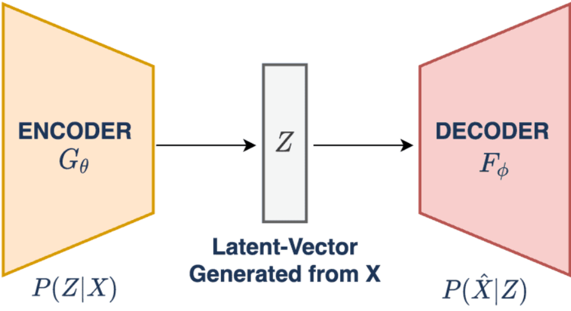
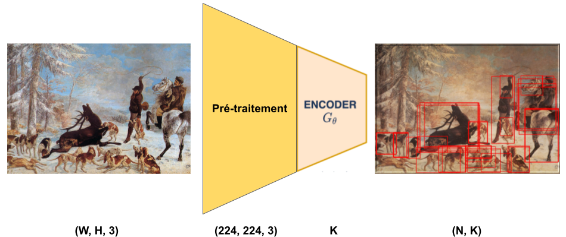
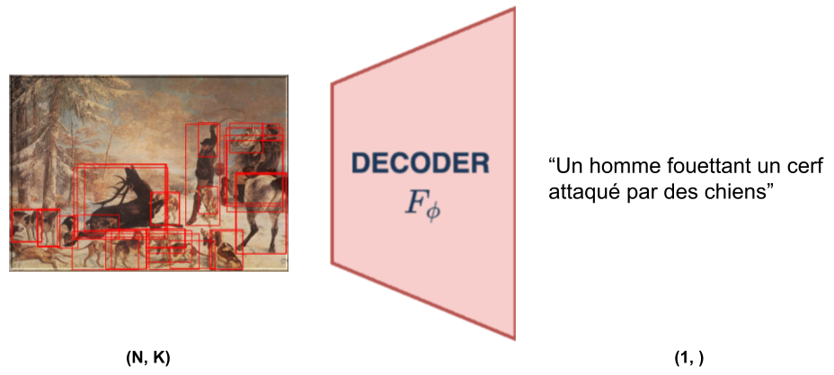

= Modèles
v1.0 2022-11-16
:doctype: report
:toc: macro
:stem: latexmath
:data-uri:
:toclevels: 3
:toc-title: Table des matières

== Introduction

Ce dépôt défini le code des différents modèles.

La suite de ce fichier explique brièvement les entrées/sorties et le fonctionnement global des modèles.

== Fonctionnemment global

Le modèle d'annotation peut être découpé en deux parties principales, de manière analogue à un _autoencoder_.

.Structure d'un autoencoder

== Encodeur / Extraction de features

L'"encodeur" d'après les link:https://git.unistra.fr/image-labellisation/ressources/-/blob/main/short/transformer.md[articles étudiés] et ce link:https://github.com/yiren-jian/Bottom-Up-Features-Detectron2[dépôt] prend en entrée des images RGB et retourne un certain nombre de **masques rectangulaires** ainsi que la **représentation latente des pixels dans le masque**.

En effet la partie "décodeur" est composée d'un R-CNN qui a pour objectif d'extraire les ROI(Region Of Interest) les plus "essentielles" à la description de l'image sous forme de "bounding-box". Le nombre de bounding box est décrit par la variable stem:[N]. 
Ensuite, une représentation latente de ces stem:[N] régions va être déterminée à l'aide d'un réseau à convolution "classique" (e.g. ResNet).

Le modèle est donc chargé d'extraire un certain nombre de features mais pas la position de ces dernières (**bruh**).

D'un point de vue tensoriel, si la représentation latente est de dimension stem:[K] :

[stem]
++++
\text{input}(1) = (224, 224, 3) \\
\text{output}(1) = (N, K)
++++

_Oui, le M2 n'utilise pas la position des features ????_

.Traitement d'une image par l'encodeur

Par exemple, si l'encodeur utilise link:https://keras.io/api/applications/resnet/[ResNet] , la dimension de plongement est 2048, donc stem:[K=2048] et la sortie sera de dimension stem:[(N, 2048)].

== Décodeur / Génération d'annotation

Le "décodeur" prend en entrée les stem:[N] features de l'encodeur et utilise un réseau de link:https://git.unistra.fr/image-labellisation/ressources/-/blob/main/short/transformer.md[transformeurs] (et donc un modèle encodeur/décodeur) pour générer les tokens un à un et ainsi former une phrase.
Comme le réseau décodeur est un transformeur, les phrases finales ne pourront pas dépasser une longueur fixe stem:[L].

D'un point de vue tensoriel, si la représentation latente est de dimension stem:[K] :

[stem]
++++
\text{input}(1) = (N, K) \\
\text{output}(1) = (1, L)
++++

.Traitement des features par le décodeur

